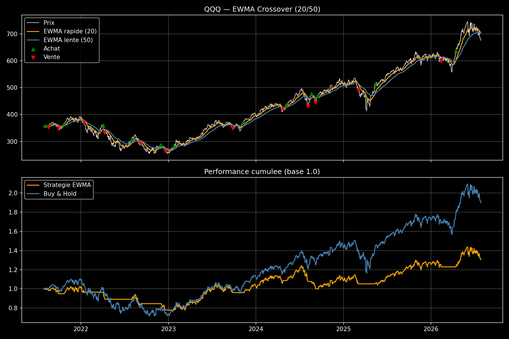

# EWMA Crossover Backtest — QQQ

A trend-following backtest of an EWMA (Exponentially Weighted Moving Average) 
crossover strategy on QQQ (Nasdaq-100 ETF) handling of lookahead bias ( using the shift).

## Strategy

- Fast EWMA (span=20) vs. slow EWMA (span=50)
- Long when fast EWMA > slow EWMA, flat (cash) otherwise
- Signal is shifted by one period (`.shift(1)`) before being applied to returns, 
  since a signal generated at close of day t can only be acted on from day t+1 
  onward — a common source of look-ahead bias in naive backtests

## Results

**Full period (2021-07-29 to 2026-07-28):**
| Metric | Strategy | Buy & Hold |
|---|---|---|
| Total return | +30.40% | +89.92% |
| Sharpe ratio | 0.43 | 0.68 |
| Max drawdown | -24.18% | -35.12% |

**2022 only (bear market):**
| Metric | Strategy | Buy & Hold |
|---|---|---|
| Total return | -22.94% | -32.58% |

The strategy underperforms buy-and-hold on both total return and Sharpe ratio 
over the full period — expected, since 2023-2026 was a sustained Nasdaq bull run 
where a trend-following strategy that sits in cash during uptrend confirmation 
delays inherently gives up upside. However, the strategy's max drawdown is 
meaningfully lower (-24.18% vs -35.12%), and it clearly outperforms during the 
2022 drawdown specifically (-22.94% vs -32.58%). This illustrates the classic 
trend-following trade-off: reduced downside risk at the cost of missed upside 
during strong uptrends — not a broken strategy, but a different risk profile.

## Run it

```bash
pip install -r requirements.txt
python ewma_crossover_qqq.py
```

## Chart

